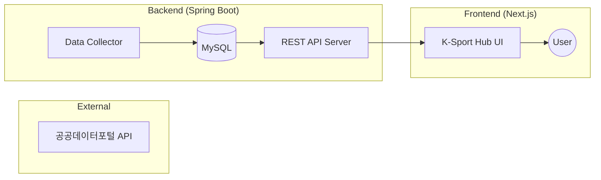

# 🚀 K-Sport Hub
> 전국공공체육시설 통합 데이터 플랫폼

## 🎬 데모 영상

  
https://github.com/zodib0123/kdt_mini_front/raw/refs/heads/main/test_video.mp4

▲ 서비스 실행 테스트 영상 (test_video.mp4)

## 🛠 기술 스택 (Tech Stack)

### 💻 Backend
| Category | Stack |
| :--- | :--- |
| **Language** |  |
| **Framework** |  |
| **Database** |  |
| **Build Tool** |  |

### 🎨 Frontend
| Category | Stack |
| :--- | :--- |
| **Library** |  |
| **Styling** |  |

## 🏗️ 시스템 아키텍처

## ⚡ 주요기능
- **REST API**: 프론트엔드와 안전하고 효율적인 통신
- **OPEN API**: SpringDocs를 이용한 REST API명세 자동화
- **JWT/OAuth2**: Spring Security의 JWT를 이용한 인증인가, OAuth2 인증기능 구현 
- **데이터 구조화**: 공공데이터 API 응답 형식을 DB에 정규화하여 저장함으로써 API 호출 비용 절감 및 조회 성능 최적화.

## 📖 문서
- [프로젝트 데모 바로가기 (vercel)](https://kdt-mini-front.vercel.app/)
- [백엔드 배포 (Render)](https://kdt03-miniproject-back.onrender.com)
- [DB 배포] 업데이트 예정
- [프론트엔드 Github 주소](https://github.com/scatch1228/kdt_mini_front)
- [전국체육시설 공공데이터](https://www.bigdata-culture.kr/bigdata/user/data_market/detail.do?id=3b5399ad-88c4-43aa-a1d7-7ef6a630370b)
